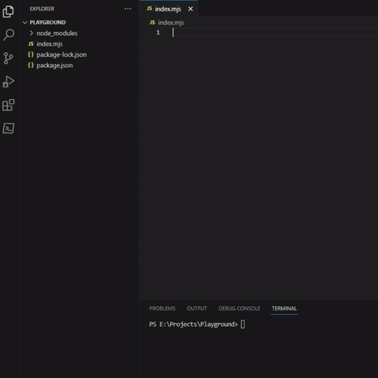

# cracksdb

A minimalist permanent state management npm package.

StateFile Architecture is the concept behind cracksdb. In case you're willing to know how exatly it works, contributes to it, or use all it's features properly. You may want to read [this article](https://dev.to/_moehab/statefile-a-minimalist-design-for-permanent-state-management-43d7).



# Usage

You can install cracksdb in your node project with the command:

```bash
npm i cracksdb
```

cracksdb can be used either by javascript or typescript. However, typescript is highly recommended for best practice; with javascript it can be easly misused. For instance, `stateFile.extendUnitType(obj: Type)` method can be passed object values that are not compatible with `Type`, and that could wind up with unexpected results or errors.

Using cracksdb is very simple, we shall first import StateManager and FileManager to initialize or minial db variable.

```typescript
import { StateManager, FileManager } from 'cracksdb'
```


Then we construct a StateManager instance by passing to the constructor the root dir value and a FileManager instance.

> FileManager constructor could be passed an object of File object values, however, it's not necessary. An empty object will do the job.

```typescript
const db = new StateManager("./db", new FileManager({}));
```

StateManager automatically scans the root dir and loads the application state for you. However, in case it's just empty so far. You may define and declare your application substates with the method `db.add(substate_name)`.

```typescript
const users = db.add("users") // returns a StateFile object
```

The structure of data units stored in _users_ substate may be defined either by using `users.extendUnitType(obj: Type)` method or by using generic `db.add<DataUnit>(...)` at the first place. However, as obvious, the generic method only specifies the unit type for typescript autocomplete. Therefore, it's highly recommended to use extendUnitType method (right after creating the StateFile with db.add(...)) to ensure data integrity, and more importantly to enable updating data units as it will be illustrated next.

> _Type_ is a map from strings to the set of values: "string", "number", "boolean", and Type itself.

```typescript
const users = db.add<{name: string}>("users")
users.extendUnitType({
    age: "number"
})
```

To update your data units you can use `StateFile.update(...)` method which takes two arguments: first the index of the data unit, and second a builder function. A builder function simply takes the data unit, at the specified index, as a parameter and returns a new data unit object with the updated fields. A worth mentioning subtlety, in StateFile update mechanism, is that update methods can only update fields that are declared by `StateFile.extendUnitType` method. As shown in the following example:

```typescript
const users = db.add<{name: string}>("users")
users.extendUnitType({
    age: "number"
})
users.add({
    name: "Joe",
    age: 30
})
users.update(0, (prev) => ({ age: prev.age + 1 })) // yields { name: "Joe", age: 31 }
users.update(0, (prev) => ({ name: "John", age: 25 })) // throws an error as name is not declared in the unittype 
```

> You can add (unupdatable) fields that are not declared in the unittype. However, this practice is not recommended; as the undeclared fields will get removed automatically if extendUnitType is invoked again. In fact, extendUnitType could be computationally very expensive; it trims and restructs all data units in all state files.

To retrieve StateFiles from `db`, remove, or delete them. You may write:

```typescript
const users = db.get("users") 
users.add({
    name: "Jack",
    age: 20
})

console.log(user.get(0)) // {name: "jack", age: 20}
console.log(user.getWhere(obj => (obj.age > 15))) // {name: "jack", age: 20}
console.log(user.removeWhere(obj => (obj.age > 15))) // [true]

db.remove("users") // only removed virtually (from RAM).
db.delete("users", "mypassword") // removes users virtually and physically. 

```

StateManager can delete a StateFile only if it's been assigned a _passkey_ at first place. passkeys can be assigned to StateFiles by passing them in the second parameter of `db.add(substate_name, passkey)` method.

```typescript
const mysf = db.add("mysf", "password")
db.delete("mysf", ""); // logs a warning
db.delete("mysf", "password"); // deletes mysf files
```

With cracksdb version 1.1.0 or later, you can declare array fields just like declaring objects in the `StateFile.extendUnitType` method, but with the _length_ attribute defined as "number".

```typescript
const users = db.add("users")
users.extendUnitType({
    username: "string",
    posts: {
        length: "number",
        title: "string",
        content: "string"
    }
})

users.add({
    username: "John",
    posts: [{
        title: "My First Post",
        content: "Lorem..."
    }]
})

users.extendUnitType({ posts: { views: "number" } })

console.log(users.get(0)) // { username: "John", posts: [{title: "My First Post", content: "Lorem...", view: 0}] }
```

That's pretty much it. Now you are ready to go with crackdb. 

In case you want to know more about cracksdb and how it works, you may read [this article](https://dev.to/_moehab/statefile-a-minimalist-design-for-permanent-state-management-43d7). Or you can just play around with it by using the below interface as a reference to its methods.

```typescript
interface StateFile<DataUnit> {
    len(): number;
    passkey(): string;
    setLimit(limit: number): void;
    getSimul(): boolean;
    setSimul(simul: boolean): void;

    addMetaAttr(attr: string, value: string): boolean;
    rmvMetaAttr(attr: string): boolean;
    getUnitType(): Type;
    extendUnitType(extension: Type): void;
    
    get(index: number): DataUnit;
    getWhere(cond: Condition<DataUnit>): DataUnit;
    getList(from: number, to: number): Array<DataUnit>;
    getListWhere(cond: Condition<DataUnit>): Array<DataUnit>;
    getIndexOf(cond: Condition<DataUnit>): number[];

    add(obj: DataUnit): void;
    update(index: number, builder: (prev: DataUnit) => DataUnit): void;
    updateWhere(cond: Condition<DataUnit>, builder: (prev: DataUnit) => DataUnit): boolean[];
    remove(index: number): void;
    removeWhere(cond: Condition<DataUnit>): boolean[];

    loadAll(): void;
    loadOne(): boolean;
    unloadOne(): boolean;

    seal(newCrackData?: Array<DataUnit>): void;
    split(): void;
    save(): void;
}
```
